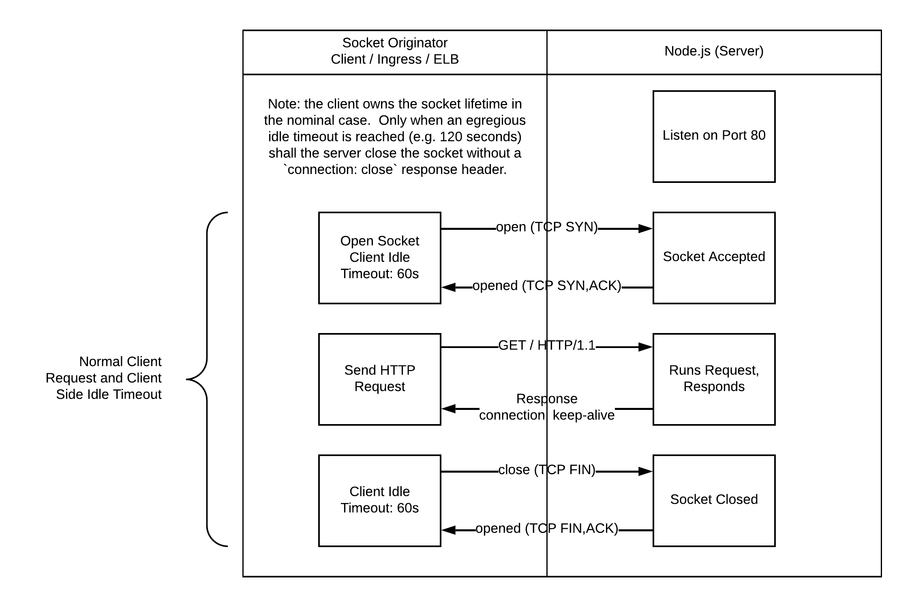
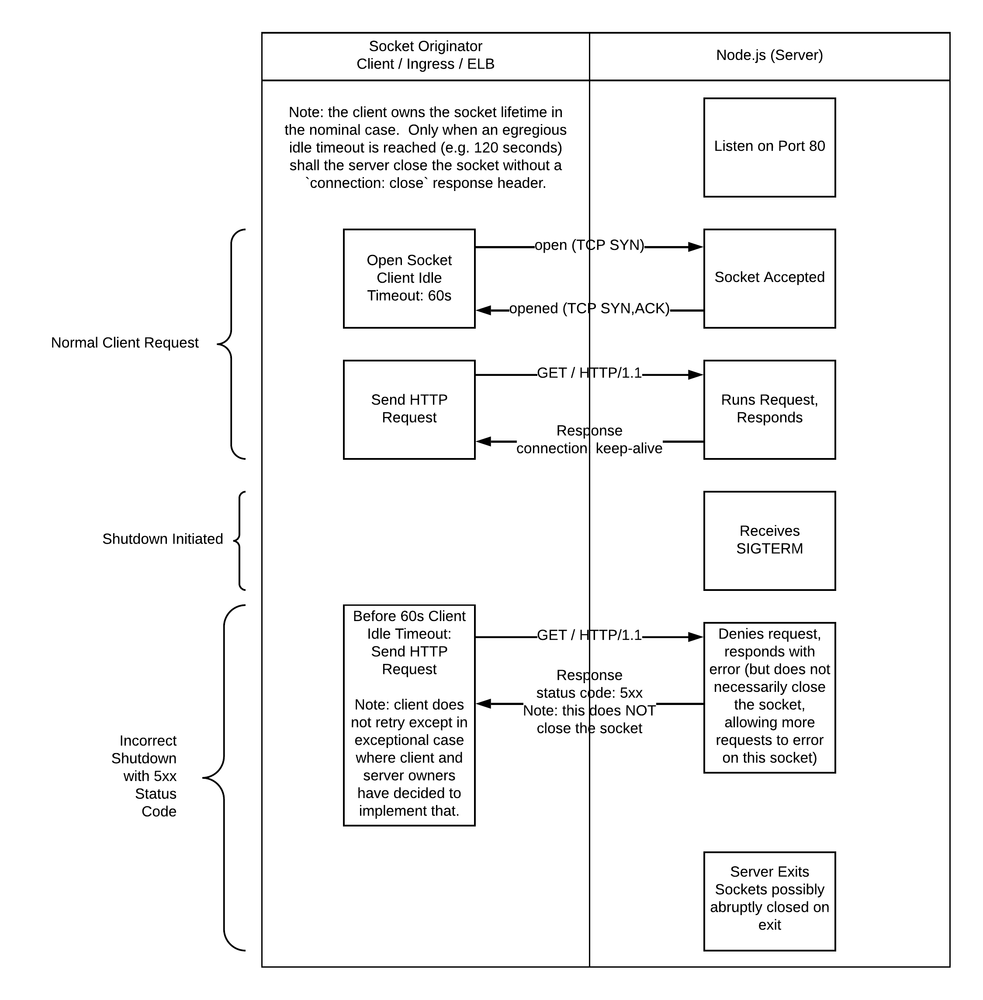
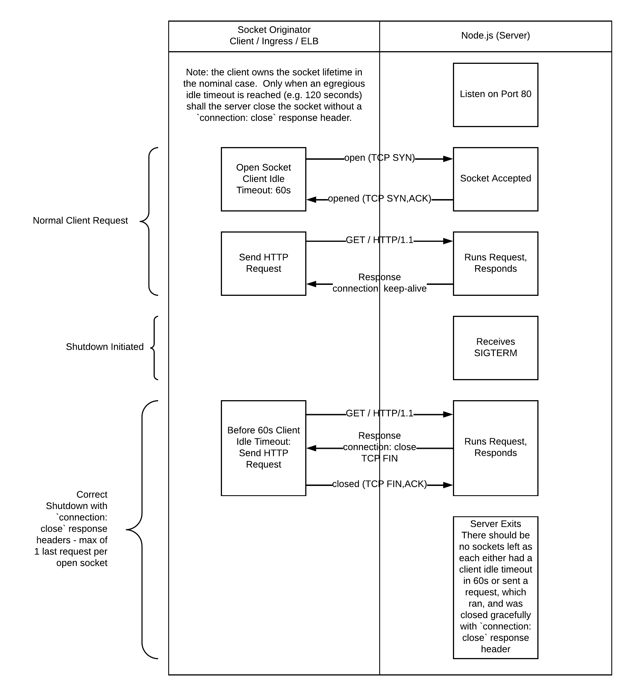
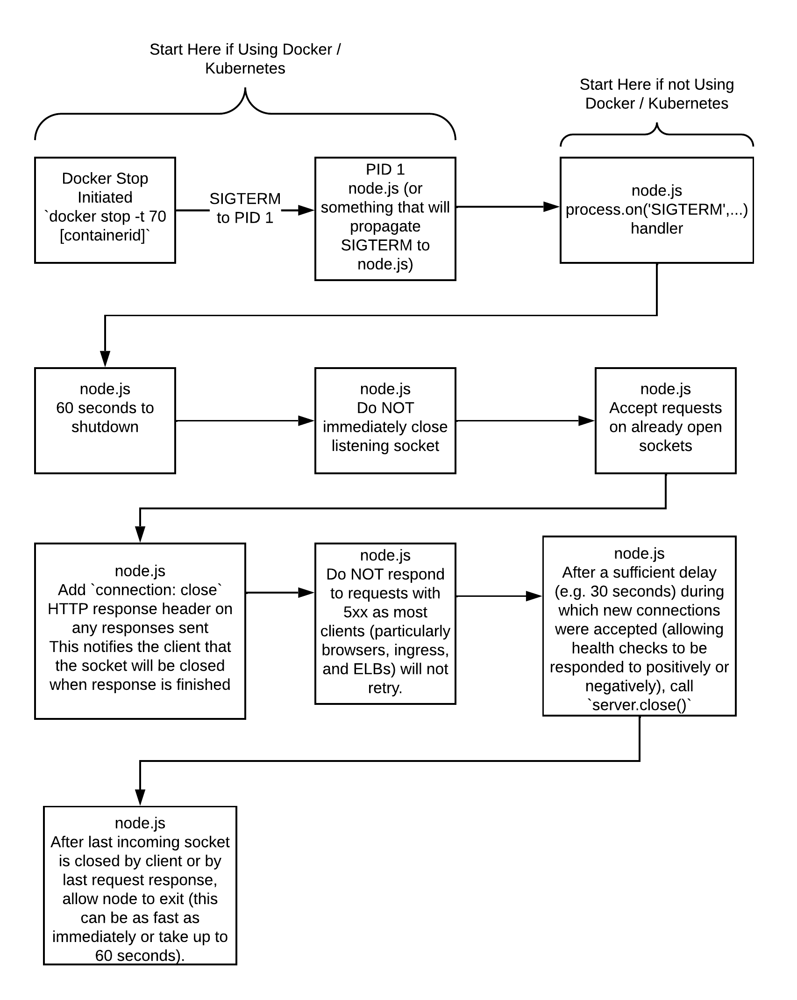
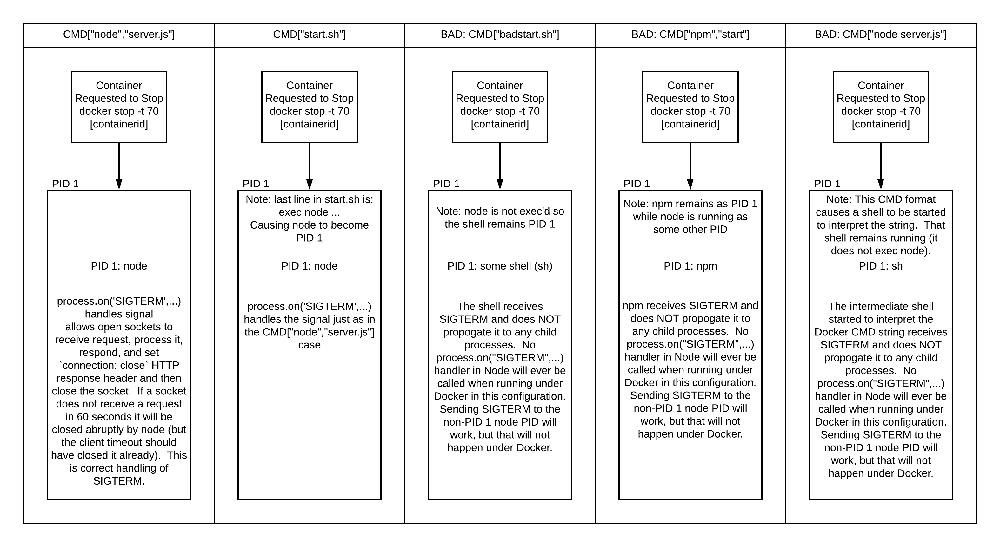
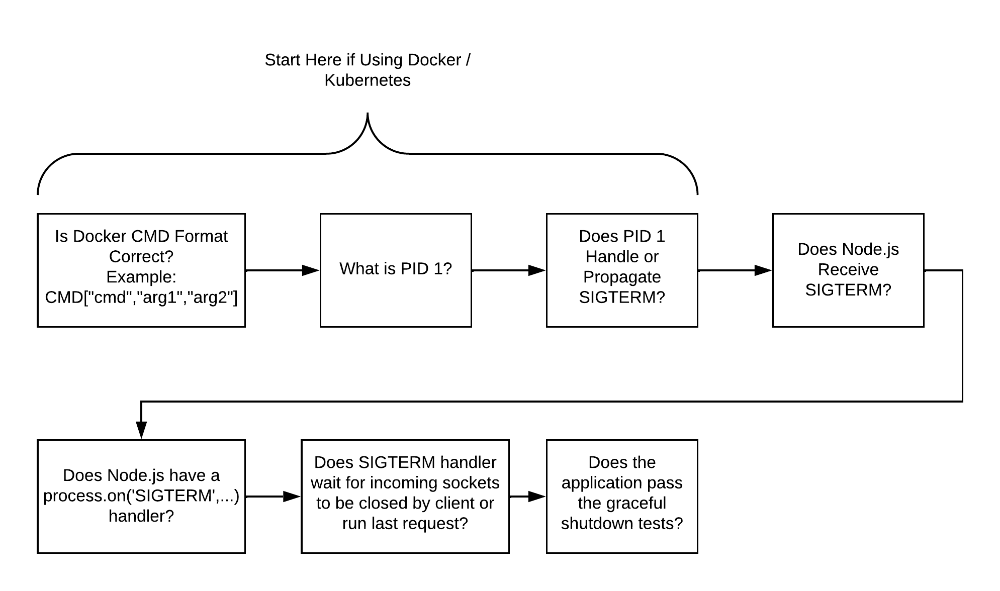

# express-graceful-exit

Gracefully run last [Express](http://expressjs.com/) requests and respond with `Connection: close` response headers while optionally still allowing new connections for a time (e.g. for readiness probes) while shutting down your application.

# Table of Contents <!-- omit in toc -->

- [express-graceful-exit](#express-graceful-exit)
- [Why Graceful Shutdown](#why-graceful-shutdown)
  - [HTTP Socket Lifecycle](#http-socket-lifecycle)
    - [HTTP Socket Lifetime - Nominal Case](#http-socket-lifetime---nominal-case)
    - [HTTP Socket Lifecycle - Incorrect Shutdown with 5xx Response Codes](#http-socket-lifecycle---incorrect-shutdown-with-5xx-response-codes)
    - [HTTP Socket Lifecycle - Correct Shutdown with `connection: close` Response Headers](#http-socket-lifecycle---correct-shutdown-with-connection-close-response-headers)
  - [Node.js Graceful Shutdown Steps - Receiving and Reacting to SIGTERM](#nodejs-graceful-shutdown-steps---receiving-and-reacting-to-sigterm)
    - [Steps to Receive and React to SIGTERM](#steps-to-receive-and-react-to-sigterm)
    - [Example Docker CMD and Impacts on PID 1 / Graceful Shutdown](#example-docker-cmd-and-impacts-on-pid-1--graceful-shutdown)
- [Validating Graceful Shutdown](#validating-graceful-shutdown)
  - [Testing Node.js Directly](#testing-nodejs-directly)
  - [Testing with `docker-compose`](#testing-with-docker-compose)
  - [Testing with `docker`](#testing-with-docker)
  - [Troubleshooting Graceful Shutdown Problems](#troubleshooting-graceful-shutdown-problems)
- [Installation](#installation)
- [Usage](#usage)
  - [middleware](#middleware)
  - [gracefulExitHandler](#gracefulexithandler)
  - [trackConnections](#trackconnections)
- [Options](#options)
  - [Middleware](#middleware-1)
  - [Exit Handler](#exit-handler)
- [Overview of Module Operation](#overview-of-module-operation)
- [Zero Downtime Deploys](#zero-downtime-deploys)
- [Compatibility](#compatibility)
  - [v1.0.0 is backwards compatible with v0.x.x, with these notes:](#v100-is-backwards-compatible-with-v0xx-with-these-notes)
  - [v0.X.X versions are backwards API compatible, with these minor behavior changes:](#v0xx-versions-are-backwards-api-compatible-with-these-minor-behavior-changes)
- [Contributors](#contributors)

# Why Graceful Shutdown

Graceful shutdown is necessary if your infrastructure needs your application to exit itself to avoid terminating in-flight requests and generating errors / alarms.

Examples of infrastructures that need graceful shutdown processing:

- Using a load balancer / ELB that removes stopping instances from the instance pool when it sees non-200 responses to healthchecks
  - In this case the application needs to be notified about the pending exit so it can return a non-200 healthcheck and drain existing connections with a `connection: close` response header if they receive an additional request before being closed by the load balancer
  - The load balancer / ELB will stop sending new connections to the instance when it sees the healthcheck failing
  - When the connection count reaches zero, `server.close()` will return and the `node` process will exit
- Using Docker / Kubernetes
  - Docker / Kubernetes will send the `STOPSIGNAL` to a stopping pod and will log errors if the container for the pod does not exit before the timeout (Docker) or `terminationGracePeriodSeconds` (Kubernetes) expires
  - Kubernetes will send a pod the `STOPSIGNAL` at the same time that it initiates removing the pod from service endpoints (which also triggers `ingress-nginx` to remove the pod from the list of available upstreams for new connections)
    - Without graceful shutdown clients will see `connection refused` (ECONNREFUSED for node clients), `socket hangup`, `502` status code responses, `504` status code responses, or AWS ELB `BackendConnectionErrors` (or similar for other load balancers) when a pod is deleted due to deploy, deploy scale down, or horizontal pod autoscaling (HPA) initiated scale down

Examples of infrastructures that do NOT need graceful shutdown handling, but can still benefit from it:

- Load balancers that detect invalid healthchecks from an instance
  - Remove that instance from the list of instances that can receive new connections (most load balancers do this)
  - Actively isolate and client-side initiate a close of all idle connections to the unhealthy instance
  - Actively client-side initiate a close of all in-use connections to the unhealthy instance when their response is received
  - In this case the target application can either
    - Simply call `server.close()` when the shutdown signal is received
      - This will cause healthchecks to be unreachable and will block Express from exiting until all existing connections are closed
    - Have the infrastructure hard stop the application after an amount of time that is greater than any request will take (e.g. 2 minutes)
      - This will cause connections to databases and other services to be abnormally ended even if idle - This is not great but can be acceptable in some environments
- Infrastructures where all the clients use HTTP/1.0 or HTTP/1.1 non-`keep-alive` connections
  - Node.js, by default, does not use `keep-alive` on it's client sockets to other services
    - This means that every request must resolve DNS, establish a TCP socket, setup TLS if using `https`, send a request, get a response, close the connection, then repeat _all of those steps_ for the next request
  - Waiting for the maximum response time (e.g. `server.timeout`) of one request will essentially guarantee that an instance has no further incoming connections
  - This is not foolproof though as the choice of whether to use non-keep-alive connections is left to the client - Express would have to be configured with middleware to send a `connection: close` response header to every request, even those using `HTTP/1.1` or specifically sending a `connection: keep-alive` request header
- Infrastructures that just wait a really long time for applications and clients that use HTTP/1.1 keep-alive connections
  - An instance targeted for stopping is removed from the healthy instance pool, say, 30 minutes before the instance is to be stopped
  - Simply waiting 30 minutes may result in that instance having no further incoming connections, but there is no guarantee of that
  - It is possible for sockets to remain open indefintely so long as they continue to receive and respond to requests before either `server.timeout` or 1server.keepAliveTimeout` have expired
  - This method may seem like it works, but it is never guaranteed to work

## HTTP Socket Lifecycle

The HTTP socket lifecycle is supposed to be owned by the client except in extraordinary cases such as server crash or the server reaching a server-side idle timeout that should be greater than the nominal client side idle timeout.

Note that the client of the TCP socket connected to the HTTP server may be an intermediary (such as Ingress or an ELB) and not the actual client (e.g. web browser or another application). It is important to check the client idle timeout of the immediate client of the server, not only the idle timeouts of a client of an intermediary.

Configuring the server idle timeout to be less than the idle timeout of the client that is connected to the server is incorrect and leads to race conditions where the client selects a socket for use and sends a request on that socket at the same moment that the server decides to close that socket.  In that case the client interprets the socket close as the server crashing and it will not generally retry the request by default (ELB will return a 504 to the caller, Ingress will return a 502 to the caller).

The HTTP socket lifecycle needs to be correctly handled during the shutdown process so that a stopping instance handles requests just as well as an instance that will continue running.

The general idea is that a stopping instance should stop receiving new connections (but still accepting new connections) when it initiates shutdown and it should exit when it no longer has any open connections. The server should not exit with open sockets unless it reaches an extraordinary timeout. A stopping instance typically stops receiving new connections due to being removed from a pool of available instances due to either returning non-200 statuses on healthchecks (e.g. many load balancers, AWS ELBs, etc.) or due to active removal of the instance from a list of avaiable instances (e.g. stopping a pod when using `ingress-nginx` as the load balancer).

### HTTP Socket Lifetime - Nominal Case

In this case the client closes the TCP socket when the client's idle timeout (60 seconds in this case) has been reached, prior to the server's fallback idle timeout (120 seconds by default in Node.js) has been reached. This is correct client-initiated closing of an idle socket.



### HTTP Socket Lifecycle - Incorrect Shutdown with 5xx Response Codes

In this case requests on a socket, to a stopping instance, are incorrectly rejected with a 5xx response code. Rejecting requests with a 5xx response code is not correct because it will lead to failures being returned up to the user except in the rare and explicit cases where the client (possibly an intermediary like a load balancer) and server have coordinated with each other and decided that the client should specifically retry 5xx response codes. Retrying 5xx response codes is dangerous because it can lead to a stampeding herd of retries when real problems happen, ensuring that a system that went down momentarily will stay down.



### HTTP Socket Lifecycle - Correct Shutdown with `connection: close` Response Headers

In this case requests on a socket, to a stopping instance, are correctly run, a `connection: close` response header is added to the response, and the socket is closed by the server after the response body is finished sending. The client sees the `connection: close` response header and understands that the socket will be closed when the response body is finished; the client then removes the socket from any connection pool and closes their end of the socket after it is finished reading.



## Node.js Graceful Shutdown Steps - Receiving and Reacting to SIGTERM

The most important step in a graceful shutdown is to actually receive the SIGTERM signal in Node.js and run some code in response to it. Node.js / Express do nothing in response to SIGTERM by default; Node.js / Express do not contain builtin logic to properly handle graceful shutdown. Without an external module, calling `server.close()` on Express after SIGTERM will close the listening socket and continue running requests, responding with `connection: keep-alive` response headers; the connections can stay open indefinitely if they never have a gap of more than `server.timeout` or `server.keepAliveTimeout` milliseconds between requsts and responses. Unfortunately, there are many many graceful shutdown modules that do not completely handle graceful shutdown correctly (they tend to close sockets abruptly, not add `connection: close` response headers, close the listening socket too soon, send 5xx response codes, or even allowing the received requests to run without being able to send the response to the client).

- Node.js Receives SIGTERM
  - Node.js must receive SIGTERM to initiate the graceful shutdown process
  - Using Docker / Kubernetes
    - Node.js is PID 1
      - In this case node can run code in response to SIGTERM because it is the process that receives SIGTERM directly when docker stop is initiated
      - Dockerfile Example:
        - `CMD["node","server.js"]`
    - Node.js is Not PID 1
      - In this case everything in the process tree above node must propagate the SIGTERM signal down to node. If anything in the process tree does not propagate the signal to child processes then the signal will not be received by node.
      - Dockerfile Examples:
        - FAILS: `CMD["node server.js"]` - This starts an intermediate shell process as PID 1 that lives for the duration of the container; shells do not propagate SIGTERM
        - FAILS: `CMD["npm run start"]` - This starts npm as PID 1 that lives for the duration of the container; npm does not propagate SIGTERM
        - FAILS: `CMD["yarn start"]` - This starts yarn as PID 1 that lives for the duration of the container; yarn does not propagate SIGTERM
        - MIXED: `CMD["start.sh"]` - This starts a shell script that will either start `npm` (wrong) or `node`. Node must be the last command and must be `exec`'d so that it replaces the shell as PID 1
- Node.js Reacts to SIGTERM
  - Node.js must have a `process.on("SIGTERM",...)` call that initiates the graceful exit process
- Node.js Correctly Accepts Request on Open Sockets
  - Node.js should accept any requests, run them, and respond with a `connection: close` response header
  - Node.js will close the socket after sending the response when the `connection: close` response header is set - This is allowed per the HTTP protocol
  - express-graceful-exit 1.0.0+ will operate this way when configured with:
    - `performLastRequest: true`
    - `errorDuringExit: false`
    - `hardExitTimeout: 70000`

### Steps to Receive and React to SIGTERM



### Example Docker CMD and Impacts on PID 1 / Graceful Shutdown



# Validating Graceful Shutdown

> Note: the protocol specified in the telnet tests must be `HTTP/1.1`, which defaults to `connection: keep-alive`; if `HTTP/1.0` is used instead the connection will be closed by default after a response.

It is necessary to test Node.js directly to ensure it receives and responds to any graceful shutdown signal correctly. After validating that Node.js is handling the signal correctly it is necessary to continue evaluating other infrastructure components (e.g. Docker, Kubernetes, AWS ECS, VMWare, etc.) if Node.js will actually receive the signal at the correct point in the shutdown process and that Node.js will be given enough time (typically at least 70 seconds) to gracefully close all connections.

## Testing Node.js Directly

> Note: SIGTERM is the default graceful shutdown signal in Docker. Kubernetes stops the pod via a Docker stop command so the shutdown signal can be customized in the Dockerfile with the STOPSIGNAL directive. SIGTERM is not technically a Kubernetes graceful shutdown signal as Kubernetes only initiates the pod deletion which triggers the containers to be sent their configured stop signal by Docker.

Node.js must respond correctly to SIGTERM; if this test fails the issues must be resolved before continuing to test other infrastructure compoments.

- Test Setup
  - Terminal 1: node server.js
  - Terminal 2: telnet localhost 3000
  - Terminal 3: Get the pid of node (e.g. ps -ef | grep server.js)
- Send a request before shutdown
  - Terminal 2: GET / HTTP/1.1 [press enter twice]
  - Expected: Response with `connection: keep-alive` response header, connection not closed
- Initiate shutdown
  - Terminal 3: kill -SIGTERM [nodepid]
  - Terminal 2: Confirm telnet has not exited with connection closed
  - Terminal 1: Confirm node has received SIGTERM but not exited
- Confirm socket still accepted (if desired / configured)
  - Set `serverCloseMinDelay` to `30000` to make this easier to test
  - Shortly after `kill -SIGTERM [nodepid]` is run:
    - Terminal 4: telnet localhost 3000
    - Expected: Connection should be established
    - Terminal 4: GET / HTTP/1.1 [press enter twice]
    - Expected: Response with `connection: close` response header, connection closed
    - Additional: test your healthcheck / readiness probe route and confirm it returns unhealthy if desired or required by your infrastructure
- Send last request
  - Terminal 2: GET / HTTP/1.1 [press enter twice]
- Expected: request runs, response received, `connection: close` header on response, connection closes and telnet exits
  - Terminal 1: Node prints that last socket has closed and exits within ~1-2 seconds of response being sent

## Testing with `docker-compose`

Testing with `docker-compose` makes the process of testing with `docker` slightly easier as the image id and container id are implied rather than looked up then copied / pasted into commands.

Additionally, if the STOPSIGNAL is misconfigured in the Dockerfile (e.g. set to SIGHUP) then this procedure will send that incorrectly configured signal to Node.js and Node.js will either react to it or not react to it, replicating what will happen in a Kubernetes environment when a pod is stopped gracefully.

> Note: The `docker-compose.yml` file can contain overrides for the entrypoint and command of the `Dockerfile`. If the tests fail, start a shell in the container with `docker-compose exec [service-name] /bin/sh` while the server is running then run `ps -ef` to see if `node` is indeed running as PID 1; if `node` is not PID 1 then review the `docker-compose.yml` file for entrypoint or command overrides that start an intermediate shell or `npm`, causing the STOPSIGNAL to not reach `node`.

- Test Setup
  - Terminal 1: `docker-compose build && docker-compose run --service-ports app`
  - Terminal 2: `telnet localhost 3000`
- Send a request before shutdown
  - Terminal 2: `GET / HTTP/1.1` [press enter twice]
  - Expected: Response with `connection: keep-alive` response header, connection not closed
- Initiate shutdown
  - Terminal 3: `docker-compose stop -t 70`
  - Terminal 2: Confirm telnet has not exited with connection closed
  - Terminal 1: Confirm node has received SIGTERM but not exited
- Confirm socket still accepted (if desired / configured)
  - Set `serverCloseMinDelay` to `15000` to make this easier to test
  - Shortly after `kill -SIGTERM [nodepid]` is run:
    - Terminal 4: `telnet localhost 3000`
    - Expected: Connection should be established
    - Terminal 4: `GET / HTTP/1.1` [press enter twice]
    - Expected: Response with `connection: close` response header, connection closed
    - Additional: test your healthcheck / readiness probe route and confirm it returns unhealthy if desired or required by your infrastructure
- Send last request
  - Terminal 2: `GET / HTTP/1.1` [press enter twice]
  - Expected: request runs, response received, `connection: close` header on response, connection closes and telnet exits
  - Terminal 1: Node prints that last socket has closed and exits within ~1-2 seconds of response being sent, and docker-compose exits with code 0
  - Terminal 3: `docker-compose stop` returns indicating that the container has finished stopping

## Testing with `docker`

Testing with docker replicates what happens during a Kubernetes graceful pod deletion, but it requires more copying/pasting than when using docker-compose.

- Test Setup
  - Terminal 1: `docker build -t app . && docker -p 3000:3000 run app`
  - Terminal 2: `telnet localhost 3000`
- Send a request before shutdown
  - Terminal 2: `GET / HTTP/1.1` [press enter twice]
  - Expected: Response with `connection: keep-alive` response header, connection not closed
- Initiate shutdown
  - Terminal 3: `docker ps`
  - Copy the [containerid] into the clipboard
  - Terminal 3: `docker stop [containerid] -t 70`
  - Terminal 2: Confirm telnet has not exited with connection closed
  - Terminal 1: Confirm node has received SIGTERM but not exited
- Confirm socket still accepted (if desired / configured)
  - Set `serverCloseMinDelay` to `15000` to make this easier to test
  - Shortly after `kill -SIGTERM [nodepid]` is run:
    - Terminal 4: `telnet localhost 3000`
    - Expected: Connection should be established
    - Terminal 4: `GET / HTTP/1.1` [press enter twice]
    - Expected: Response with `connection: close` response header, connection closed
    - Additional: test your healthcheck / readiness probe route and confirm it returns unhealthy if desired or required by your infrastructure
- Send last request
  - Terminal 2: `GET / HTTP/1.1` [press enter twice]
  - Expected: request runs, response received, `connection: close` header on response, connection closes and telnet exits
  - Terminal 1: Node prints that last socket has closed and exits within ~1-2 seconds of response being sent, and docker exits with code 0
  - Terminal 3: `docker stop` returns indicating that the container has finished stopping

## Troubleshooting Graceful Shutdown Problems



# Installation

```bash
$ cd /path/to/your/project
$ npm install express-graceful-exit
```

# Usage

The following two components must both be used to enable clean server shutdown, where incoming requests are gracefully declined.

## middleware

This middleware should be the very first middleware that gets setup with your Express app. The complete example under [gracefulExitHandler](#gracefulexithandler) shows how to listen for shutdown signals and start the graceful exit processs in response.

```typescript
import express, { Express, Request, Response } from 'express';
import * as gracefulExit from '../index';

let handledShutdown = false;
const shutdownConfig: gracefulExit.Configuration = {
  performLastRequest: true,
  exitProcess: true,
  serverCloseMinDelay: 5000,
};
const port = 3000;

const app = express();

// Register the express-graceful-exit middleware
app.use(gracefulExit.middleware(app));

// Configure some routes
// eslint-disable-next-line @typescript-eslint/no-misused-promises,@typescript-eslint/require-await
app.get('/someRequest', async (req: Request, res: Response): Promise<void> => {
  console.log('someRequest');
  res.json({ route: 'someRequest' });
});
app.get('/healthcheck', (req: Request, res: Response): void => {
  console.log('healthcheck');
  res.json({ route: 'healthcheck' });
});

// Listen for connections
const server = app.listen(port);

// Ensure connections stay open at least as long as our load balancer expects them to stay open
server.keepAliveTimeout = 120 * 1000;
// For node v12 and earlier, ensure that we do not reject pre-established connections (e.g. from an AWS Classic HTTP ELB)
// that do not send headers for a request for up to the expected idle timeout (e.g. 60 seconds).
server.headersTimeout = 120 * 1000;

//
// NOTE: The complete example under `gracefulExitHandler` shows how to listen
// for shutdown signals and start the graceful exit processs in response.
//
```

## gracefulExitHandler

Initiate the graceful exit process, including sending `connection: close` response headers after last requests on each connection, closing the Express listening socket after a configurable delay, and optionally calling `process.exit`. This method is typically to be invoked from signal handlers (e.g. `process.on('SIGTERM', () => gracefulExit.gracefulExitHandler(app, server, shutdownConfig))` or using another module that configures and manages signal handlers (though care must be taken to ensure that any exit timeouts do not conflict between the two modules).

Example source code: [src/examples/index.ts](src/examples/index.ts)

```typescript
// To run this example:
// - `npm i`
// - `npx ts-node src/examples/index.ts`
import express, { Express, Request, Response } from 'express';
import http from 'http';
import * as gracefulExit from '../index';

let handledShutdown = false;
const shutdownConfig: gracefulExit.Configuration = {
  performLastRequest: true,
  exitProcess: true,
  serverCloseMinDelay: 5000,
};
const port = 3000;

// Signal handler
function shutdownSignalHandler(
  message: NodeJS.Signals,
  app: Express,
  server: http.Server,
  logger: (msg: string) => void,
) {
  if (handledShutdown) return;
  handledShutdown = true;
  logger(`Shutdown signal received. Message: ${message}`);
  gracefulExit.gracefulExitHandler(app, server, shutdownConfig);
}

function installSignalHandler(
  app: Express,
  server: http.Server,
  logger: (msg: string) => void,
): void {
  // Connect signal handler for graceful shutdown signals
  process.on('SIGTERM', (message) => shutdownSignalHandler(message, app, server, logger));
  process.on('SIGINT', (message) => shutdownSignalHandler(message, app, server, logger));
  process.on('SIGHUP', (message) => shutdownSignalHandler(message, app, server, logger));
}

const app = express();

// Register the express-graceful-exit middleware
app.use(gracefulExit.middleware(app));

// Configure some routes
// eslint-disable-next-line @typescript-eslint/no-misused-promises,@typescript-eslint/require-await
app.get('/someRequest', async (req: Request, res: Response): Promise<void> => {
  console.log('someRequest');
  res.json({ route: 'someRequest' });
});
app.get('/healthcheck', (req: Request, res: Response): void => {
  console.log('healthcheck');
  res.json({ route: 'healthcheck' });
});

// Listen for connections
const server = app.listen(port);

// Ensure connections stay open at least as long as our load balancer expects them to stay open
server.keepAliveTimeout = 120 * 1000;
// For node v12 and earlier, ensure that we do not reject pre-established connections (e.g. from an AWS Classic HTTP ELB)
// that do not send headers for a request for up to the expected idle timeout (e.g. 60 seconds).
server.headersTimeout = 120 * 1000;

// Listen for the shutdown signals
installSignalHandler(app, server, (message) => {
  console.log(message);
});
```

## trackConnections

Note: named `init` prior to v1.0.0

This function should only be called when setting `destroySocketsOnHardExit` to `true` as it has a cost of tracking each opened / closed connection in a dictionary. Prior to version v1.0.0, the connections where tracked using an `Array` which potentially had `O(n^2)` performance, and always had at least `O(n)` performance, on the number of current connections, depending on the implementation of `Array.splice` and whether it copies any elements in the existing array.

# Options

## Middleware

There are no options available currently.

## Exit Handler

The following options are available:

| Option                  | Description                                                                                                                                                                                                                                                                                                                 | Default                                                                                            |
| :---------------------- | :-------------------------------------------------------------------------------------------------------------------------------------------------------------------------------------------------------------------------------------------------------------------------------------------------------------------------- | :------------------------------------------------------------------------------------------------- |
| **log**                 | Print status messages and errors to the logger                                                                                                                                                                                                                                                                              | false                                                                                              |
| **logger**              | Function that accepts a string to output a log message. If `logger` is provided and `log` is not set to `false`, then `log` will be implied to be `true`                                                                                                                                                                    | console.log                                                                                        |
| **callback**            | Optional function that is called with the exit status code once express has shutdown, gracefully or not <br> Use in conjunction with `exitProcess: false` when the caller handles process shutdown                                                                                                                          | no-op                                                                                              |
| **performLastRequest**  | Process the first request received per connection after exit starts, and include a connection close header in the response for the caller and/or load balancer. <br> The current default is `false`, but will default to `true` in the next major release, `false` is deprecated as of v0.5.0                               | true, **true is recommended**                                                                      |
| **errorDuringExit**     | When requests are refused during graceful exit, respond with an error instead of silently dropping them. <br> The current default is `false`, but will default to `true` in the next major release, `false` is deprecated as of v0.5.0                                                                                      | false, **false is recommended**                                                                    |
| **getRejectionError**   | Function returning rejection error for incoming requests during graceful exit                                                                                                                                                                                                                                               | `function () { return new Error('Server unavailable, no new requests accepted during shutdown') }` |
| **exitProcess**         | If true, the module calls `process.exit()` when express has shutdown, gracefully or not                                                                                                                                                                                                                                     | true                                                                                               |
| **exitDelay**           | Wait timer duration in the final internal callback (triggered either by gracefulExitHandler or the hard exit handler) if `exitProcess: true`                                                                                                                                                                                | 10ms                                                                                               |
| **serverCloseMinDelay** | This option prevents `server.close` from being called sooner than a minimum delay from when `gracefulExitHandler` is called.                                                                                                                                                                                                | undefined                                                                                          |
| **serverCloseMaxDelay** | This option guarantees that `server.close` will be called by a maximum delay from when `gracefulExitHandler` is called.                                                                                                                                                                                                     | 60000 ms (60 seconds)                                                                              |
| **hardExitTimeout**     | Final timeout (in milliseconds) when `process.exit` should be called even if graceful shutdown has not completed.                                                                                                                                                                                                           | 130000 ms (2m 10s)                                                                                 |
| **socketio**            | An instance of `socket.io`, used to close all open connections after timeout                                                                                                                                                                                                                                                | none                                                                                               |
| **force**               | Instructs the module to forcibly close sockets once the hard exit timeout elapses. <br> For this option to work you must call `gracefulExit.trackConnections(server, app)` when initializing the HTTP server. Tracking the connections does incur a small cost to generate an ID and store the connections in a dictionary. | false                                                                                              |

# Overview of Module Operation

To gracefully exit this module does the following things:

1. After an optional minimum delay (e.g. 5 to 30 seconds), closes the http server's listening socket so no new connections are accepted
1. Sets `Connection: close` response header for Keep-Alive connections, if configured for responses
   1. If `performLastRequest` is true, the request is run and a response is sent with a `Connection: close` header
   1. If `errorDuringExit` is true, HTTP status code 502 is returned by default, so nginx, ELB, etc will resend to an active server
   1. If both `performLastRequest` and `errorDuringExit` are set to false then the request is not run and the HTTP status code will be 200 - This is not recommended
1. If a socket.io instance is passed in the options, all connected clients are immediately disconnected (socket.io v0.X through v1.4.x support)</br> The client should have code to reconnect on disconnect
1. Once the server fully disconnects or the hard exit timer runs
   1. If all existing connections have run a request and/or disconnected, the exit handler returns `0`
   1. OR if any connections remain after `hardExitTimeout` ms, the handler returns `1`
1. In either case, if `exitProcess` is set to true the hard exit handler waits `exitDelay` ms and calls `process.exit(x)`, this allows the logger time to flush and the app's callback to complete, if any

# Zero Downtime Deploys

This module handles the difficult work of gracefully closing sockets and the Express server in response to a developer choosing to initiate that process. It is possible and simple to install signal handlers, such as `SIGTERM` for Docker's default `STOPSIGNAL` without any additional dependencies and [src/examples/index.ts](src/examples/index.ts) shows how to accomplish this. Some prefer using another module to register signal handlers; this is fine, but care must be taken to ensure that the additional module does not add it's own shutdown timeouts that conflict with the timeouts set in `express-graceful-exit`.

# Compatibility

## v1.0.0 is backwards compatible with v0.x.x, with these notes:

1. v1.0.0 Overall backwards compatible with the exception of uses cases that were passing `force: true` and calling `init` - In that one case `init` must be changed to `trackConnections` and both `server` and `app` must be passed to it
1. v1.0.0 renames `init` to `trackConnections` and requires passing both the Express `server` and `app` - Note that `trackConnections` should ONLY be called if `force`/`destroySocketsOnHardExit` is `true` as the list of Express sockets is not necessary in any other case - As the usage of `init` is rarely necessary, calling `init` will log an error advising to call `trackConnections` instead and continue
1. v1.0.0 renames `suicideTimeout` to `hardExitTimeout`. Values passed via `suicideTimeout` will be copied over top of `hardExitTimeout`
1. v1.0.0 renames `force` to `destroySocketsOnHardExit`. Values passed via `force` will be copied over top of `destroySocketsOnHardExit`

## v0.X.X versions are backwards API compatible, with these minor behavior changes:

1. After exit was triggered, incoming requests were mismanaged prior to v0.5.0. <br> As of v0.5.0 incoming requests are dropped cleanly by default, with new options such as responding with a custom error and/or performing one last request per connection.
1. Process exit is called in a `setTimeout` block from v0.2.0 forward, so the timing is slightly different between v0.1.0 to v0.2.x+.

# Contributors

- Original Author: [Jon Keating](http://twitter.com/emostar)
  - This module was originally developed for Frafty (formerly www.frafty.com), a Daily Fantasy Sports site.
- Maintainer: [Ivo Havener](https://github.com/ivolucien)
- Contributor: [Harold Hunt](https://github.com/huntharo)
